# Auspify Full-Stack Tasks Suite

A portfolio of four production-grade, enterprise-scale full-stack web applications developed for Auspify. Each project is engineered with **Next.js 16 (App Router)**, **TypeScript (Strict Mode)**, **MongoDB Atlas (Mongoose 9)**, custom **Argon2id + dual-cookie JWT authentication**, and **responsive-by-default design systems**.

[](https://nextjs.org/)
[](https://react.dev/)
[](https://www.typescriptlang.org/)
[](https://www.mongodb.com/)
[](https://tailwindcss.com/)
[](https://vitest.dev/)
[](https://youtu.be/GSONik1QADQ?si=qM3gDQelQtST0J2q)

> 🎬 **Interactive Video Walkthrough**: [Watch the full system demo & walkthrough on YouTube](https://youtu.be/GSONik1QADQ?si=qM3gDQelQtST0J2q) to explore live interactions, features, authentication flows, and database mutations without running local servers.
>
> 📄 **Evaluation & Setup Guide**: A complete, printable execution guide is provided in [`Setup.pdf`](Setup.pdf) at the root of the repository.

---

## 📑 Table of Contents

- [Project Overview](#-project-overview)
- [1. Expense Tracker & Wealth Intelligence](#1-expense-tracker--wealth-intelligence)
- [2. Job Portal Application (Paperfolio Neo-Brutalist)](#2-job-portal-application-paperfolio-neo-brutalist)
- [3. Enterprise Learning Management System (LMS)](#3-enterprise-learning-management-system-lms)
- [4. Student Management System (SMS)](#4-student-management-system-sms)
- [Universal Engineering & Security Standards](#-universal-engineering--security-standards)
- [Repository Structure](#-repository-structure)
- [Getting Started & Local Development](#-getting-started--local-development)

---

## 🌟 Project Overview

| Application | Core Domain | Key Highlights | Primary Stack |
|---|---|---|---|
| **[Expense Tracker](#1-expense-tracker--wealth-intelligence)** | Personal Finance & Wealth Intelligence | Integer minor-unit currency math, sub-10ms MongoDB aggregation pipelines, dual-cookie JWT session rotation, dynamic budget limits | Next.js 16, TypeScript, MongoDB, TanStack Query v5, Tailwind |
| **[Job Portal](#2-job-portal-application-paperfolio-neo-brutalist)** | Talent & Hiring Platform | Paperfolio Neo-Brutalist design, multi-role (Seeker/Employer/Admin), immutable application snapshots, anti-enumeration safeguards | Next.js 16, React 19, TypeScript, MongoDB, Tailwind v4, shadcn/ui |
| **[Learning Management System](#3-enterprise-learning-management-system-lms)** | E-Learning & Assessment Studio | Server-authoritative timed quizzes, curriculum video/markdown player, grading workflow, cryptographically verifiable certificates | Next.js 16, React 19, TypeScript, MongoDB, TanStack Query, shadcn/ui |
| **[Student Management System](#4-student-management-system-sms)** | Educational Administration | Institutional KPIs, student directory with PII isolation, typed deletion safeguard, formula-safe CSV export, first-login password gate | Next.js 16, React 19, TypeScript, MongoDB, Vitest, Playwright |

---

## 1. Expense Tracker & Wealth Intelligence

An editorial-grade personal finance and budgeting platform engineered for precision, privacy, and speed. Designed to eliminate floating-point arithmetic errors while delivering real-time financial intelligence and spending analytics.

### 📐 Architectural Highlights
- **Integer Minor Units (Cents/Paise):** Stored strictly as integer values (`$42.50` = `4250` cents) to avoid IEEE-754 floating-point precision flaws. Formatting is handled cleanly via `Intl.NumberFormat`.
- **Sub-10ms Aggregation Pipelines:** Monthly spend trends, net worth trajectories, and category spending allocations are processed server-side via MongoDB `$facet`, `$group`, and `$sum` pipelines.
- **Argon2id + Dual-Cookie JWT:** Access token (15m, `SameSite=Lax`) and refresh token (7d, `SameSite=Strict`) with Refresh Token Rotation (RTR) and token family reuse detection.
- **Optimistic State & Cache Invalidation:** Powered by TanStack Query v5 with atomic query key updates across transactions, budgets, and balance metrics.

### 🛠️ Tech Stack
- **Framework:** Next.js 16 (App Router, Server Components & Route Handlers)
- **Database:** MongoDB Atlas + Mongoose 9 (Connection pooling with `globalThis` caching)
- **State & UI:** TanStack Query v5, Tailwind CSS, Lucide React
- **Validation & Testing:** Zod (`.strict()`), Vitest + `mongodb-memory-server`

### 📸 Application Showcase

#### Dashboard & Financial Intelligence
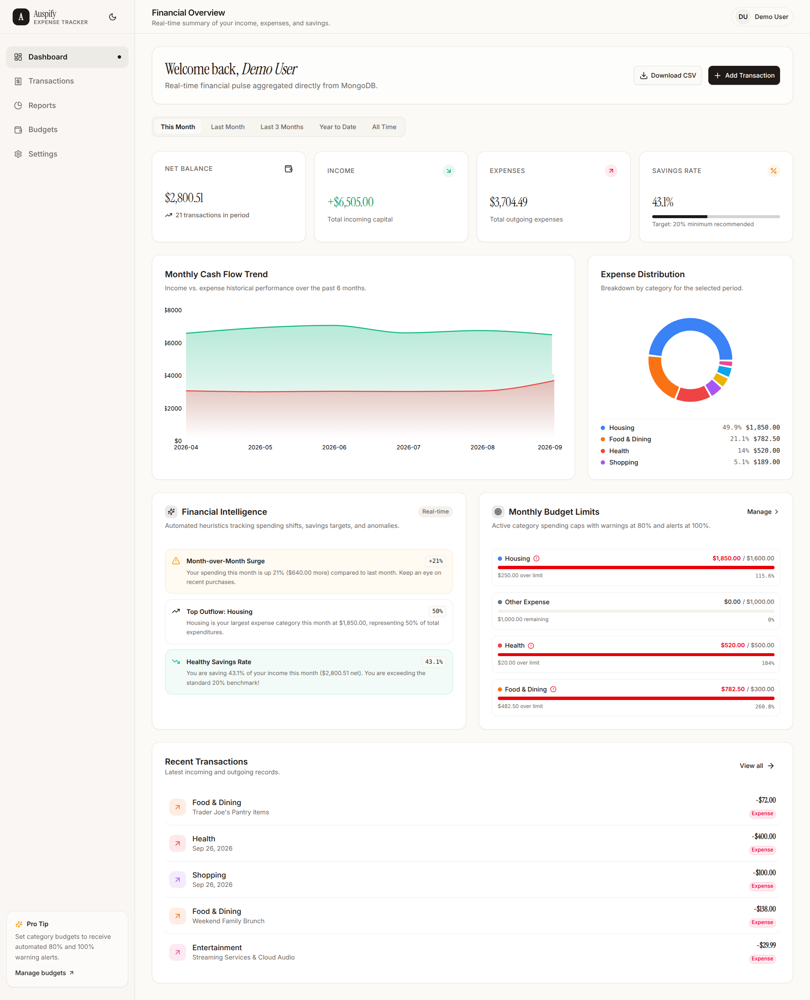

#### Dynamic Budgets & Spending Limits
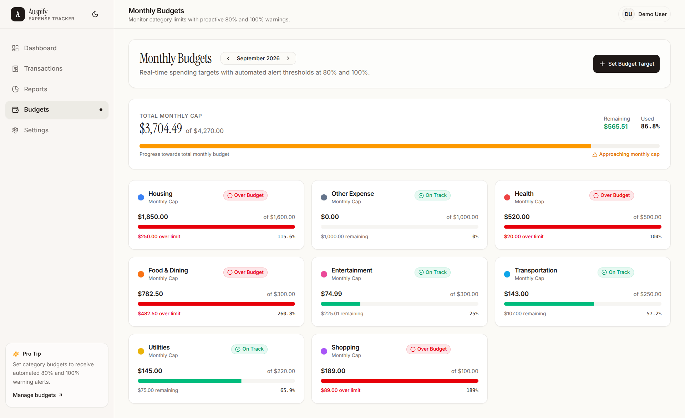

#### Landing Page & Authentication
<p align="center">
  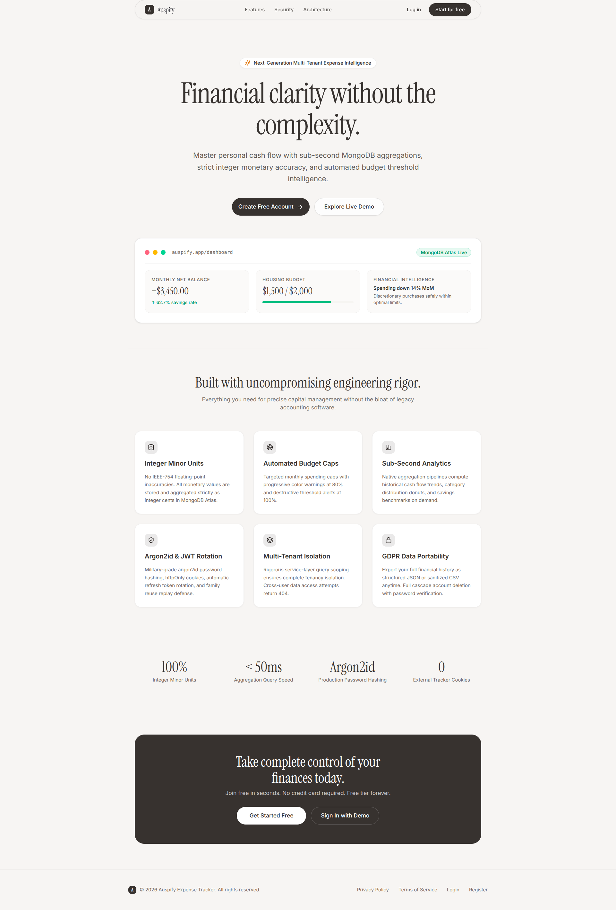
  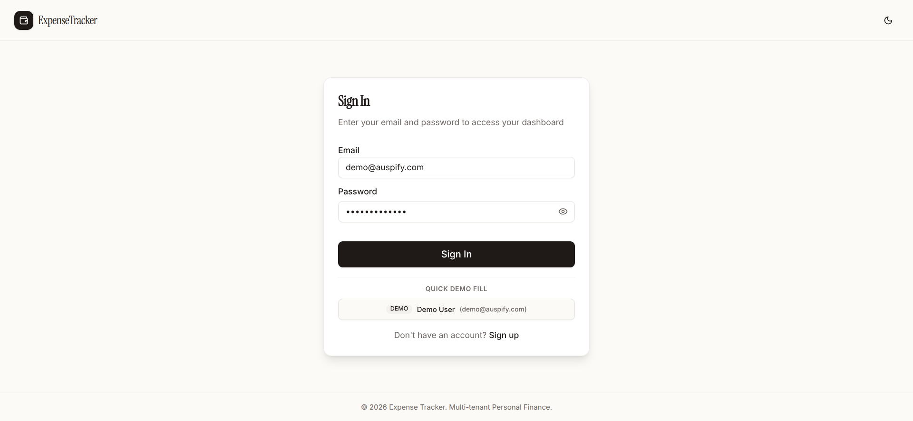
</p>

---

## 2. Job Portal Application (Paperfolio Neo-Brutalist)

A production-ready job portal connecting talent with hiring companies, styled in a distinctive **Paperfolio Neo-Brutalist** aesthetic with tactile offset shadows, thick black borders, and punchy status tags.

### 🎨 Neo-Brutalist Design System
- **Bold Geometry:** High-contrast 2px and 4px solid black borders (`border-2 border-black` / `border-4 border-black`).
- **Tactile Depth:** Hard-edge offset drop shadows (`shadow-[4px_4px_0px_0px_rgba(0,0,0,1)]`).
- **Fluid Breakpoints:** Tested across 360px mobile viewports, 768px tablets, and 1440px+ ultra-wide desktop monitors.

### 🚀 Key Role Workflows
1. **Public & Job Seekers:**
   - Real-time catalog search with debounced keyword queries, remote toggles, category selectors, and salary filters.
   - **Immutable Application Snapshots:** Candidate resumes and profiles are deep-copied at submission time, guaranteeing application integrity even if the seeker modifies their profile later.
   - **Compound Deduplication:** Indexed unique compounds prevent duplicate applications per listing (HTTP 409 Conflict).
2. **Employers:**
   - Full job lifecycle (Draft, Publish, Archive, Close) with automatic category counter synchronization.
   - Interactive candidate pipeline review (`StatusStepper`) with stage transitions and cover letter inspection.
3. **Administrators:**
   - Platform governance dashboard tracking system health, listings, and user distributions.
   - User moderation with role updates, instant session invalidation, and immutable non-repudiation audit trails.
   - Safeguards preventing self-demotion, self-suspension, or deleting the last active admin.

### 🛠️ Tech Stack
- **Framework:** Next.js 16 (App Router, React 19, Server Components by default)
- **Styling:** Tailwind CSS v4, shadcn/ui primitives, Lucide Icons
- **Database:** MongoDB Atlas via Mongoose 9
- **Security:** Argon2id hashing, dual-cookie JWT sessions, CSRF origin verification

### 📸 Application Showcase

#### Public Job Catalog
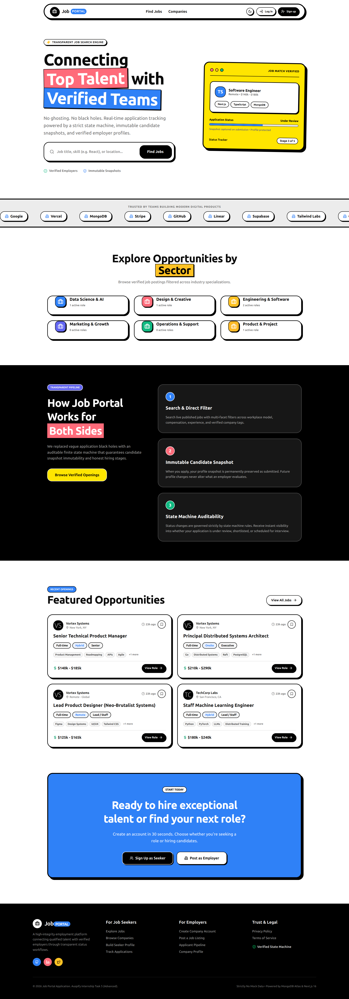

#### Seeker Application Pipeline Dashboard
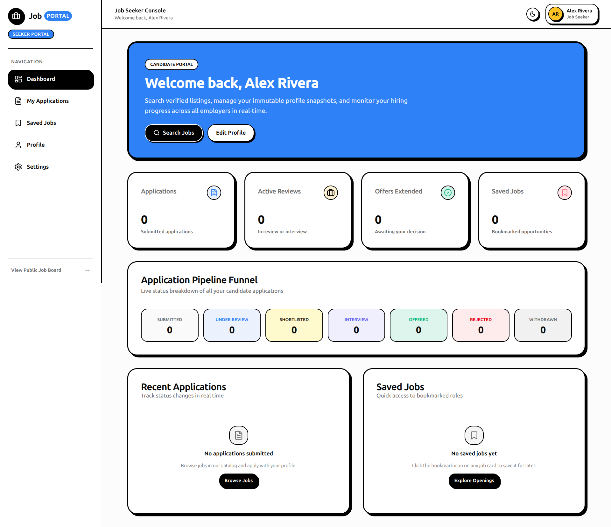

#### Employer Management & Candidate Review
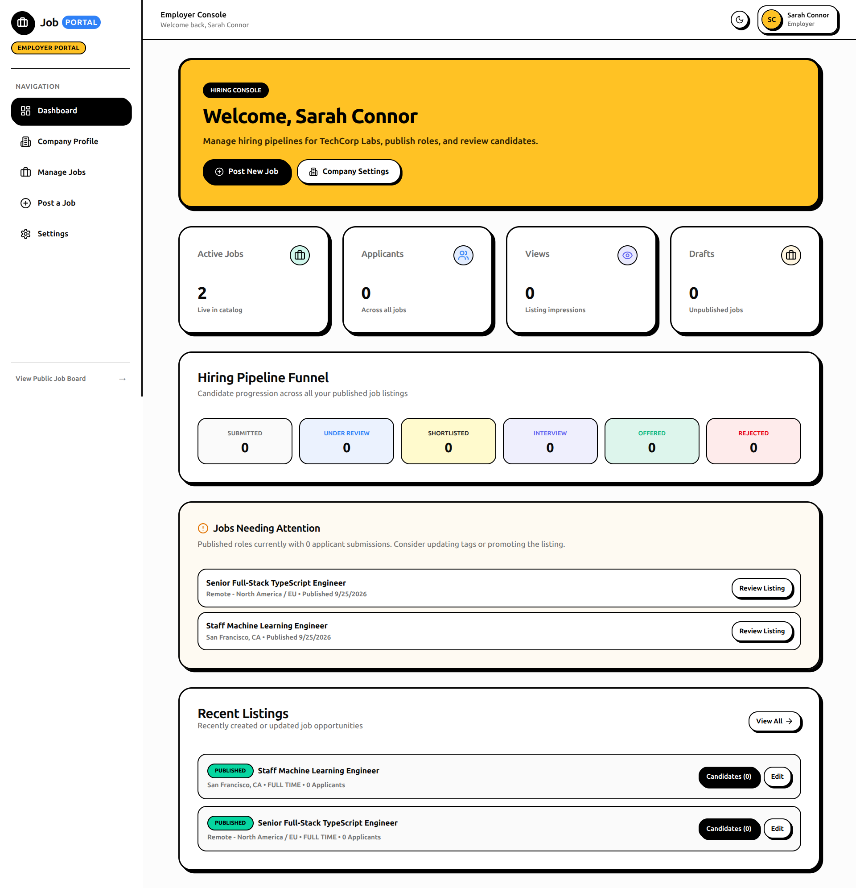

#### Admin Command & Platform Governance
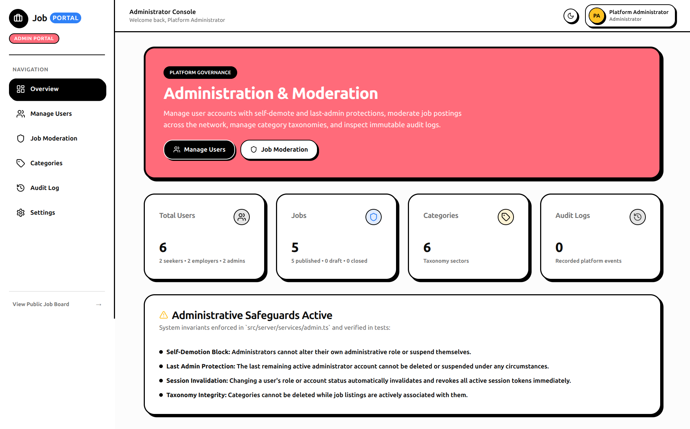

---

## 3. Enterprise Learning Management System (LMS)

A full-scale, full-stack Learning Management System crafted with zero-mock data principles, defense-in-depth security policies, server-authoritative assessment scoring, and automated certificate issuance.

### 🎓 Key Modules
- **Interactive Student Classroom:** Video player supporting embed streaming alongside sanitized rich markdown reading modules with mark-as-complete tracking.
- **Server-Authoritative Timed Quizzes:** Multi-question quiz engine with server-enforced countdown timers, randomized questions, and zero-leak client evaluation (answers are never exposed to the client bundle).
- **Instructor Studio:** Modular curriculum builder (modules, video lectures, markdown notes), assignment authoring, and grading queues with pedagogical feedback.
- **Verifiable Digital Credentials:** Auto-generated idempotent digital certificates with unique verifiable codes (`EDU-XXXXXXXX`) and public validation links.
- **Admin Governance & Audit Trail:** User role lifecycle management, course approval and moderation queues, and append-only audit logging.

### 🛠️ Tech Stack
- **Framework:** Next.js 16 (React 19, App Router)
- **Language:** TypeScript 5.7+ (Strict Mode enabled, zero `any`)
- **Styling:** Tailwind CSS v4, shadcn/ui, Radix UI primitives
- **Database:** MongoDB Atlas + Mongoose 9
- **State & Data Fetching:** TanStack React Query v5

### 📸 Application Showcase

#### Course Catalog & Discovery
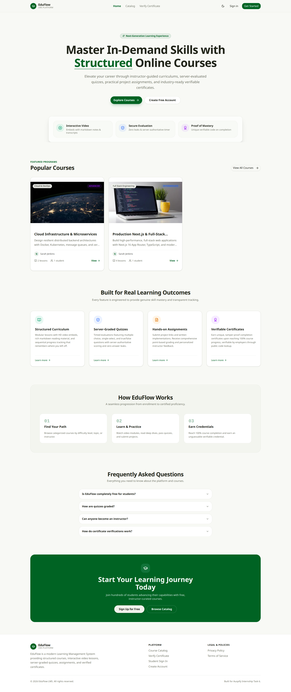

#### Student Learning & Curriculum Progress
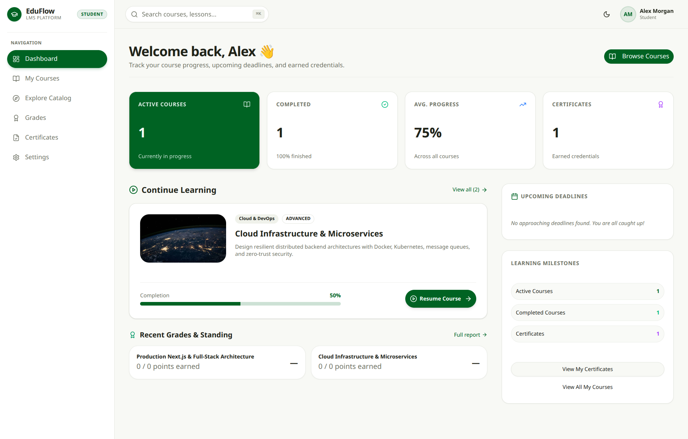

#### Instructor Studio & Curriculum Management
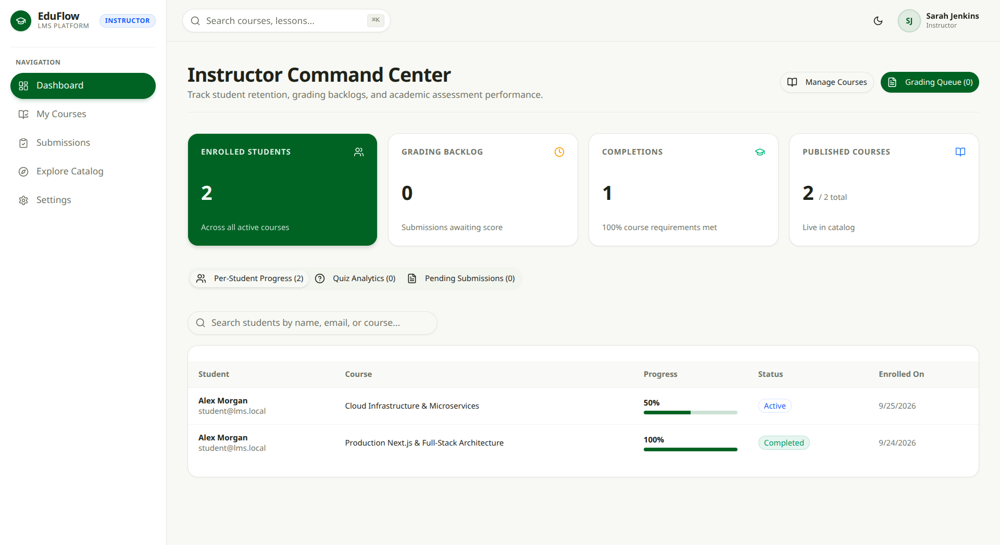

#### Administrator Command Center
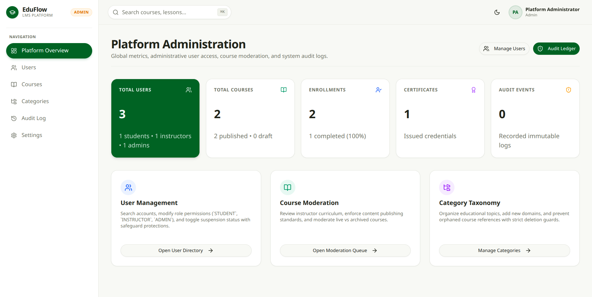

---

## 4. Student Management System (SMS)

A mission-critical internal web application designed for educational institutions, school administrators, and academic staff to manage student enrollments, class cohorts, and sensitive student records with rigorous privacy guarantees.

### 🏫 Key Modules & Protections
- **Institutional KPI Dashboard:** Real-time metrics showing total student population, class capacities, overall seat utilization rates, cohort distribution progress bars, and recent admissions.
- **Student Directory & Sensitive PII Masking:**
  - Minors' personal information (Date of Birth, calculated age, home address, guardian contact details) is strictly hidden from general list views and accessible only on authenticated detail profiles (`/students/[id]`).
  - Fluid responsive display: Interactive data tables on desktop viewports and touch-friendly card stacks on mobile devices.
- **Class & Cohort Management:** Grade level configuration, homeroom teacher assignments, capacity limits, and relational integrity guards (classes cannot be deleted while active or historical student records reference them).
- **Typed Deletion Safeguard:** Eliminating accidental record deletion by requiring operators to type the exact student ID or name to confirm, preceded by an immutable `AuditLog` entry.
- **Formula-Injection Safe CSV Export:** Download filtered and sorted student rosters with active sanitization of formula prefixes (`=`, `+`, `-`, `@`).
- **First-Login Password Gate:** Newly provisioned staff accounts with temporary credentials are automatically gated to `/change-password` before granting application access.

### 🛠️ Tech Stack
- **Framework:** Next.js 16 (App Router, Turbopack, React 19)
- **Styling & UI:** Tailwind CSS v4, shadcn/ui primitives, Lucide Icons (Slate/Zinc monochromatic theme)
- **Database:** MongoDB Atlas via Mongoose 9 (`sanitizeFilter` and `trusted()` query defenses)
- **Validation & Testing:** Zod (`.strict()`), Vitest, Playwright

### 📸 Application Showcase

#### Institutional Metrics & Capacity Analytics
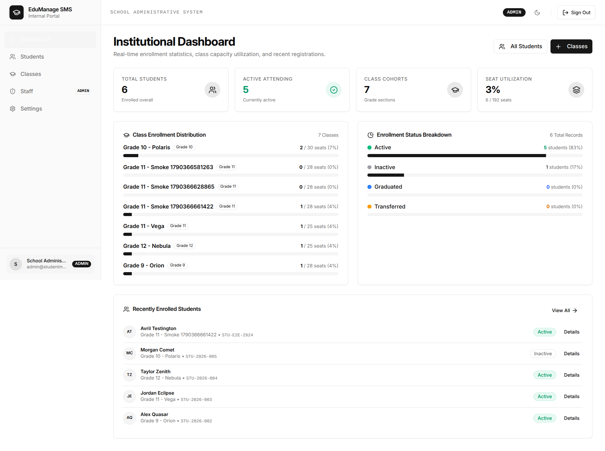

#### Student Directory & Homeroom Cohorts (Dark Mode)


#### Staff Authentication & First-Login Password Gate
<p align="center">
  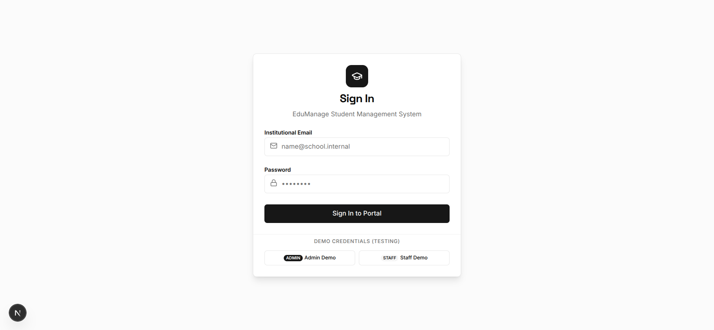
  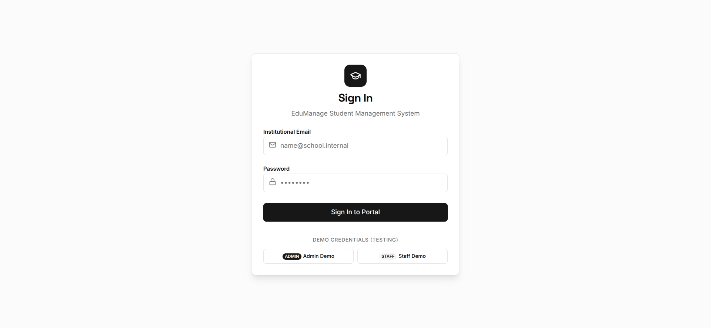
</p>

---

## 🔒 Universal Engineering & Security Standards

Across all four applications in this monorepo, uniform architectural principles are enforced:

### 1. Zero-Mock Data & Production Integrity
Every view, calculation, chart, and status stepper communicates with real database collections and server endpoints. No hardcoded mock datasets or fabricated client state.

### 2. Defense-in-Depth Authentication
- **Password Security:** Salted hashes generated via Argon2id (`@node-rs/argon2`, $m=64\text{MB}, t=3, p=4$).
- **Dual-Cookie / Dual-Secret JWT:** Ephemeral access tokens (15m) paired with rotating refresh tokens (7d) stored exclusively in `httpOnly`, `secure`, and `SameSite` cookies.
- **Session Family Revocation:** Automatic token rotation with family replay detection. Any presentation of an already-used token triggers immediate invalidation of the entire session family across all devices.
- **CSRF & Origin Verification:** State-changing requests validate HTTP `Origin` and `Host` headers to prevent cross-site request forgery.

### 3. Strict Schema Sanitization
- All API payloads, URL params, and query strings are parsed through Zod schemas using `.strict()`, automatically rejecting unauthorized or malicious parameters.
- MongoDB query sanitization (`sanitizeFilter: true`) prevents NoSQL query injection attacks.

### 4. Responsive-by-Default Fluid Layouts
Every page and modal is built with responsive fluidity supporting:
- Small mobile devices (`360px - 480px`)
- Tablets (`768px - 1024px`)
- Laptops and desktop screens (`1280px - 1440px`)
- Ultra-wide and 4K displays (`2560px+`) with centered max-width containers.

---

## 📂 Repository Structure

```text
auspify_tasks/
├── README.md                          # Global repository showcase documentation
├── expense_tracker/                   # Personal finance & wealth intelligence platform
│   ├── src/                           # Next.js App Router, components, server services
│   ├── screenshots/                   # Application screenshots
│   ├── package.json                   # Dependencies & scripts
│   └── README.md                      # Detailed project documentation
├── job_portal_application/            # Paperfolio Neo-Brutalist talent & hiring portal
│   ├── src/                           # Next.js App Router, components, server services
│   ├── screenshots/                   # Application screenshots
│   ├── package.json                   # Dependencies & scripts
│   └── README.md                      # Detailed project documentation
├── learning_management_system/        # Enterprise e-learning & assessment platform
│   ├── src/                           # Next.js App Router, components, server services
│   ├── screenshots/                   # Application screenshots
│   ├── package.json                   # Dependencies & scripts
│   └── README.md                      # Detailed project documentation
└── student_management_system/         # School administration & student cohort system
    ├── src/                           # Next.js App Router, components, server services
    ├── screenshots/                   # Application screenshots
    ├── package.json                   # Dependencies & scripts
    └── README.md                      # Detailed project documentation
```

---

## 🚀 Getting Started & Local Development

### Prerequisites
- [Node.js](https://nodejs.org/) v20.x or higher
- [npm](https://www.npmjs.com/) or [pnpm](https://pnpm.io/)
- [MongoDB Atlas](https://www.mongodb.com/atlas) connection URI or a local MongoDB instance

### Quick Setup Instructions

Each application functions independently with its own environment configuration and package manifest:

#### 1. Expense Tracker
```bash
cd expense_tracker
npm install
cp .env.example .env.local    # Fill in your MONGODB_URI and JWT secrets
npm run dev                    # Starts at http://localhost:3000
```

#### 2. Job Portal Application
```bash
cd job_portal_application
npm install
cp .env.example .env.local    # Configure database URI and security secrets
npm run dev                    # Starts at http://localhost:3000
```

#### 3. Learning Management System (LMS)
```bash
cd learning_management_system
npm install
cp .env.example .env.local    # Configure database URI and secrets
npm run dev                    # Starts at http://localhost:3000
```

#### 4. Student Management System (SMS)
```bash
cd student_management_system
npm install
cp .env.example .env.local    # Configure database URI and secrets
npm run dev                    # Starts at http://localhost:3000
```

---

## 📄 License
This repository and all included projects are released under the [MIT License](LICENSE).
