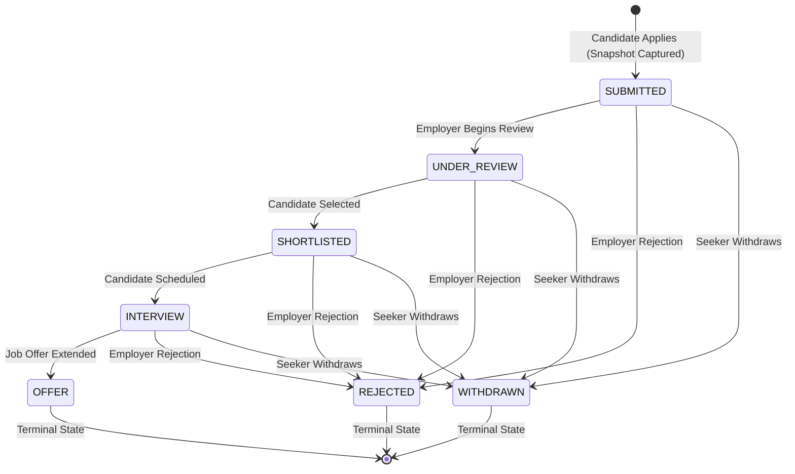

# Job Portal Application

A high-performance, production-ready Full-Stack Job Portal platform connecting talent with top companies. Built with **Next.js 16 (App Router, Server Components by default)**, **TypeScript (Strict)**, **MongoDB Atlas (Mongoose)**, **Tailwind CSS v4**, **shadcn/ui**, and custom **Argon2id + JWT Session Rotation** authentication. Designed in the high-contrast **Paperfolio Neo-Brutalist** aesthetic.

---

## 🎨 Neo-Brutalist Design System

The application features the **Paperfolio Neo-Brutalist** aesthetic:

- **Bold Geometry:** High-contrast 2px and 4px solid black borders (`border-2 border-black` / `border-4 border-black`).
- **Tactile Depth:** Sharp, hard-edge offset drop shadows (`shadow-[4px_4px_0px_0px_rgba(0,0,0,1)]` and `shadow-[6px_6px_0px_0px_rgba(0,0,0,1)]`).
- **Punchy Color Accents:** Vivid badge and tag highlights across status badges, role tags, and interactive CTA buttons.
- **Responsive by Default:** Fluid layout adapting seamlessly across 360px mobile viewports, 768px tablets, and 1440px+ ultra-wide displays without horizontal scrolling.

---

## 🚀 Key Features by Role

### 1. Public & Job Seekers

- **Public Job Catalog:** Real-time search with debounced keyword queries, multi-select category filters, location filters, remote toggle, and salary range sliders.
- **Strict Published Isolation:** Public catalog queries enforce `status: PUBLISHED` in the database service layer—drafts and archived listings never leak.
- **Job Details & SEO:** Server-rendered job pages with canonical URLs, OpenGraph metadata, and structured JSON-LD `JobPosting` schema for Google search rich snippets.
- **Seeker Profile:** Profile editor with real-time preview, skills tagger, portfolio/resume links, and work history.
- **Immutable Application Flow:** Deep-copied `profileSnapshot` at application time guarantees resume integrity. Duplicate applications are blocked by a compound unique index (HTTP 409 Conflict).
- **Application Tracker:** Interactive mobile-responsive `StatusStepper` tracking pipeline status in real-time with withdrawal capabilities.
- **Saved Jobs:** Quick bookmarking and management of favorite opportunities.

### 2. Employers

- **Company Management:** Company profile setup with logo allowlist verification, industry categorization, and employee headcount.
- **Job Posting Lifecycle:** Complete draft, review, publish, and close lifecycle with automatic category counter synchronization.
- **Candidate Funnel & Review:** Filter applicants by stage, review candidate profile snapshots, inspect cover letters, and transition candidates through the hiring pipeline.
- **Employer Dashboard:** Real-time metrics on published listings, total applicants, hiring funnel breakdown, and attention alerts for listings nearing expiration.

### 3. Administrators

- **Platform Governance:** Comprehensive dashboard showing active listings, user growth, application activity, and system health.
- **User Moderation:** Search users, suspend/reactivate accounts, and promote/demote roles with automated session invalidation.
- **Administrative Safeguards:** Built-in safeguards preventing self-demotion, self-suspension, and eliminating the last active administrator.
- **Job Moderation & Category Control:** Unpublish or archive inappropriate listings, create and manage job categories with active job dependency checks.
- **Non-Repudiation Audit Logs:** Immutable structured logs capturing administrative actions, timestamps, actor IDs, target entities, and IP addresses.

### 4. Account Settings & Security

- **Security Dashboard:** Argon2id password changes, active session device management, remote single-session revocation, and "sign out all devices" capabilities.
- **Safe Account Deletion:** Strict safeguards preventing employer account deletion while active job listings remain published.

---

## 🔒 Roles & Permissions Matrix

| Feature / Resource                     | Anonymous |   Job Seeker   |  Employer  | Administrator |
| :------------------------------------- | :-------: | :------------: | :--------: | :-----------: |
| **Browse Published Jobs & Companies**  |    ✅     |       ✅       |     ✅     |      ✅       |
| **View Job Details & Company Info**    |    ✅     |       ✅       |     ✅     |      ✅       |
| **Apply to Published Job**             |    ❌     |       ✅       |     ❌     |      ❌       |
| **Manage Seeker Profile & Saved Jobs** |    ❌     |       ✅       |     ❌     |      ❌       |
| **Withdraw Submitted Application**     |    ❌     | ✅ (Pre-offer) |     ❌     |      ❌       |
| **Create & Manage Company Profile**    |    ❌     |       ❌       | ✅ (Owner) |      ❌       |
| **Post, Edit, Close Jobs**             |    ❌     |       ❌       | ✅ (Owner) |      ❌       |
| **Review Applicants & Change Status**  |    ❌     |       ❌       | ✅ (Owner) |      ❌       |
| **Moderate Jobs & Unpublish**          |    ❌     |       ❌       |     ❌     |      ✅       |
| **Manage Users & Role Assignment**     |    ❌     |       ❌       |     ❌     |      ✅       |
| **Manage Job Categories**              |    ❌     |       ❌       |     ❌     |      ✅       |
| **View System Audit Logs**             |    ❌     |       ❌       |     ❌     |      ✅       |

> **Anti-Enumeration Guarantee:** Accessing or modifying a resource belonging to another tenant returns **HTTP 404 Not Found**, never 403 Forbidden.

---

## 🔄 Application State Machine

Job applications transition strictly through a validated finite state machine. Status mutations bypassing this machine are rejected:



---

## 🛠 Tech Stack & Architecture

- **Framework:** Next.js 16 (App Router, Server Components by default, React 19)
- **Language:** TypeScript 5.x (Strict mode, no `any`, zero dead code)
- **Styling:** Tailwind CSS v4, Lucide React icons, shadcn/ui primitives
- **Database:** MongoDB Atlas with Mongoose ORM (cached connections, strict schemas, compound indexes)
- **Authentication:** Custom dual-token JWT (`jose`) with Argon2id password hashing (`@node-rs/argon2`)
- **Session Management:** Refresh token rotation with family reuse detection stored in `httpOnly`, `SameSite=Strict` cookies
- **Validation:** Zod `.strict()` validation on all incoming request payloads and query parameters
- **Testing:** Vitest with `mongodb-memory-server` for end-to-end integration and policy matrix tests

### Architecture Diagram

```
Client (Browser)
   │
   ▼
Next.js App Router (Server Components & Route Handlers)
   │
   ▼
HTTP Wrapper (src/server/http.ts)
   ├── Rate Limiting (Memory sliding-window)
   ├── CSRF Origin Check
   ├── Auth Guard (requireUser / requireRole direct from MongoDB)
   └── Zod .strict() Schema Validation
   │
   ▼
Service Layer (src/server/services/*)
   ├── Policies & Anti-Enumeration (src/server/policies/*)
   ├── State Machine Invariants
   └── Database Mutations & Audit Logging
   │
   ▼
Mongoose ODM / MongoDB Atlas Replica Set
```

---

## 💻 Quickstart & Local Setup

### 1. Prerequisites

- Node.js 20.x or later
- npm 10.x or later
- MongoDB Atlas cluster or local MongoDB instance (v6.0+)

### 2. Clone & Install Dependencies

```bash
git clone <repository-url>
cd job_portal_application
npm install
```

### 3. Environment Configuration

Create a `.env.local` file based on `.env.example`:

```bash
cp .env.example .env.local
```

Populate the required environment variables:

```env
NEXT_PUBLIC_APP_URL=http://localhost:3000
MONGODB_URI=mongodb://127.0.0.1:27017/jobportal
MONGODB_DB=jobportal

# Generate 48-byte base64 secrets: openssl rand -base64 48
JWT_ACCESS_SECRET=your-secure-access-secret-at-least-32-chars
JWT_REFRESH_SECRET=your-secure-refresh-secret-at-least-32-chars

SEED_ADMIN_EMAIL=admin@demo.local
SEED_ADMIN_PASSWORD=DemoPassword123!
```

### 4. Database Indexing & Seeding

Synchronize compound indexes and seed default categories, demo users, companies, and published job postings:

```bash
# Sync compound indexes
npm run db:index

# Seed demo data
npm run db:seed
```

### 5. Run Development Server

```bash
npm run dev
```

Navigate to `http://localhost:3000` to access the application.

---

## 🔑 Demo Credentials

| Role              | Email                 | Password           | Preloaded Context                                                           |
| :---------------- | :-------------------- | :----------------- | :-------------------------------------------------------------------------- |
| **Job Seeker**    | `seeker@demo.local`   | `DemoPassword123!` | Complete profile, submitted applications, saved jobs                        |
| **Employer**      | `employer@demo.local` | `DemoPassword123!` | Verified company ("Vortex Systems"), 3 active listings, incoming applicants |
| **Administrator** | `admin@demo.local`    | `DemoPassword123!` | Full platform administration, audit logs, user management                   |

---

## 🧪 Testing & Verification

The test suite runs against an isolated, in-memory MongoDB server (`mongodb-memory-server`), ensuring complete isolation without mutating production or local databases:

```bash
# Run all unit, policy, and full-lifecycle integration tests
npm test

# Run TypeScript typecheck
npm run typecheck

# Run ESLint validation
npm run lint

# Build production bundle
npm run build
```

---

## 📁 Repository Structure

```
├── docs/
│   ├── PLAN.md                   # 7-Day implementation plan & technical specifications
│   ├── SECURITY.md               # Security threat model & Section 13 checklist report
│   ├── feature-map.md            # Features inventory & route mapping
│   └── design-inventory.md       # Design tokens & component specifications
├── src/
│   ├── app/                      # Next.js App Router route groups
│   │   ├── (auth)/               # Login and registration flows
│   │   ├── (marketing)/          # Landing page with SEO schema
│   │   ├── (public)/             # Public catalog, job details, company profiles
│   │   ├── (seeker)/             # Seeker dashboard, applications, profile, saved jobs
│   │   ├── (employer)/           # Employer dashboard, job manager, applicant review
│   │   ├── (admin)/              # Admin moderation, users, categories, audit logs
│   │   └── api/                  # Route handlers wrapped with server/http.ts
│   ├── components/               # Modular UI components (Neo-brutalist theme)
│   ├── lib/                      # Utilities, api-client, date formatters, env validation
│   └── server/                   # Backend services, models, and policy enforcement
│       ├── auth/                 # Dual JWT token logic, cookies, argon2id hashing
│       ├── models/               # Mongoose schemas with compound indexes
│       ├── policies/             # Access control checks (404 anti-enumeration)
│       └── services/             # Core business logic executed with caller context
└── tests/                        # Vitest test suite (Unit, Policy Matrix, Smoke Tests)
```

---

## 📜 License & Compliance

Built as part of the Auspify Full-Stack Engineering Program. All security controls, state machines, and data isolation policies strictly comply with production standards.
